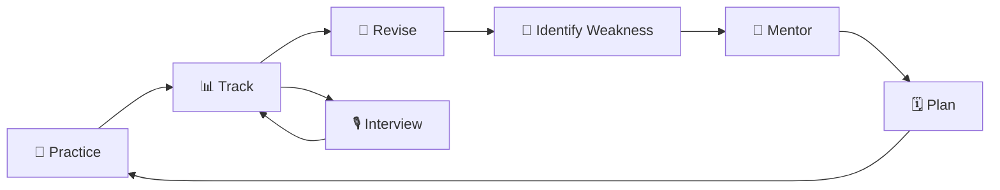

<div align="center">

#  Dykstra

### **Practice less randomly. Revise what matters. Interview with confidence.**

**An intelligent DSA preparation platform built around practice, retention, progress and realistic technical interviews.**

<br/>

[](https://dykstra.in)
[](https://github.com/Souvik34/Dykstra)
[](https://react.dev/)
[](https://nodejs.org/)
[](https://www.postgresql.org/)

<br/>

**[🌐 Explore Dykstra](https://dykstra.in) · [💻 Repository](https://github.com/Souvik34/Dykstra)**

</div>
<div align="center">


</div>


---

## ✦ The Problem

Most DSA platforms optimize for one metric:

```text
                 "How many problems did you solve?"
```

But interview preparation is not just about solving more problems.

You also need to know:

```text
What am I forgetting?
What topics am I weak at?
What should I revise today?
How confidently can I solve?
What should I practice next?
How will I perform in an interview?
```

### That's where Dykstra comes in.

> **Dykstra turns DSA preparation into a continuous feedback loop instead of a solved-problem counter.**

---

# 🧠 How Dykstra Works



Every problem you solve becomes preparation data.

That data can influence your:

**Revision → Confidence → Topic Strength → Recommendations → Interview Preparation**

---

# ✨ What Makes Dykstra Different?

<table>
<tr>
<td width="50%">

### 🔁 Forced Revision

Solved doesn't mean remembered.

Dykstra brings problems back through spaced revision and can gate new practice when revisions become due.

</td>

<td width="50%">

### 🤖 AI Mentor

Your preparation history becomes context for personalized recommendations instead of another generic AI chatbot.

</td>
</tr>

<tr>
<td>

### 🎯 Confidence

Solving a problem in 10 minutes and struggling for an hour are different preparation signals.

Dykstra tracks that difference.

</td>

<td>

### 🎙️ AI Interviews

Practice solving problems is different from explaining them under interview conditions.

Dykstra includes an AI technical interviewer named **Antonio**.

</td>
</tr>

<tr>
<td>

### 🗓️ Preparation Planner

Turn recommendations into an actual preparation plan while keeping control over what you want to work on.

</td>

<td>

### 📈 One Preparation History

Problems, revisions, progress, confidence and interviews contribute to one connected preparation journey.

</td>
</tr>
</table>

---

# 🔁 The Revision Engine

This is at the heart of Dykstra.

When you solve a problem, it shouldn't disappear forever.

```text
                    SOLVE
                      │
                      ▼
                    1 DAY
                      │
                      ▼
                    2 DAYS
                      │
                      ▼
                    4 DAYS
                      │
                      ▼
                    8 DAYS
                      │
                      ▼
                   16 DAYS
                      │
                      ▼
                   30 DAYS
                      │
                      ▼
                RETAIN THE PATTERN
```

### Six revision intervals · 1–30 days

The important part isn't the schedule itself.

It's the behavior it creates:

> **Before chasing another 100 problems, make sure you still remember the ones you've already solved.**

When revisions are due, Dykstra can enforce a **revision gate**, temporarily blocking normal new-problem solving until the pending revision work is addressed.

---

# 📊 Your Preparation, Visualized

Dykstra turns activity into signals instead of leaving you with a giant solved count.

```text
                 YOUR PREPARATION
                       │
       ┌───────────────┼───────────────┐
       ▼               ▼               ▼
   🧩 Problems      🎯 Confidence    🔁 Revision
       │               │               │
       └───────────────┼───────────────┘
                       ▼
                 📈 Progress
                       │
                       ▼
                 🤖 Mentor
                       │
                       ▼
                Next Focus Area
```

The dashboard is designed to answer:

> **"Where do I stand right now?"**

rather than:

> "Here's another number."

---

# 🤖 Meet Antonio

### Your AI technical interviewer.

Antonio is designed to make interview practice feel different from solving a normal coding problem.

```text
┌───────────────┐
│ Introduction  │
└───────┬───────┘
        ↓
┌───────────────┐
│ Understanding │
└───────┬───────┘
        ↓
┌───────────────┐
│    Coding     │
└───────┬───────┘
        ↓
┌───────────────┐
│ Optimization  │
└───────┬───────┘
        ↓
┌───────────────┐
│    Feedback   │
└───────────────┘
```

You're not only evaluated on whether the final code works.

The interview experience is built around:

- Understanding
- Communication
- Approach
- Implementation
- Complexity
- Optimization
- Interview behavior

### The goal

```text
             LeetCode
                ↓
         "Can you solve it?"
                ↓
             Dykstra
                ↓
       "Can you explain it,
        solve it and defend it?"
```

---

# 🧩 Inside the Product

<table>
<tr>
<td align="center" width="25%">

### 🧠
**Practice**

Problems + Monaco Editor

</td>

<td align="center" width="25%">

### 🔁
**Revision**

Spaced + Forced

</td>

<td align="center" width="25%">

### 🤖
**Mentor**

Personalized Guidance

</td>

<td align="center" width="25%">

### 🎙️
**Interview**

AI Simulation

</td>
</tr>
</table>

---

# 🖥️ Product Experience

> Screenshots coming from the live product should go here.

<div align="center">

### Dashboard

<!-- Replace with actual dashboard screenshot -->


</div>

<br/>

<div align="center">

### Revision

<!-- Replace with actual revision screenshot -->


</div>

<br/>

<div align="center">

### DSA Visualizer

<!-- Replace with actual interview screenshot -->


</div>

<div align="center">

### AI Interviewer

<!-- Replace with actual interview screenshot -->


</div>

---

# ⚙️ Built With

<div align="center">

### Frontend


### Backend


### AI & Infrastructure


</div>

---

# 🏗️ Engineering

Dykstra is a full-stack application built around separate product modules for:

```text
Authentication
      │
      ├── 🧩 Problems
      ├── 📈 Progress
      ├── 🔁 Revision
      ├── 🤖 Mentor
      ├── 🗓️ Planner
      └── 🎙️ Interviews
```

The platform uses:

- **React + TanStack** for the application experience
- **Node.js + Express** for backend services
- **PostgreSQL / Neon** for persistent data
- **Redis + BullMQ** for caching and background processing
- **Socket.IO** for real-time interview interaction
- **Judge0** for code execution
- **AI providers** for Mentor and interview functionality

The implementation continues to evolve as Dykstra moves toward its public launch.

<details>
<summary><strong>🔍 Technical Details</strong></summary>

<br/>

### Frontend

- React
- TypeScript
- TanStack Router
- TanStack Query
- Zustand
- Tailwind CSS
- Monaco Editor
- Recharts
- Framer Motion
- Zod

### Backend

- Node.js
- Express
- PostgreSQL
- Neon
- Redis
- BullMQ
- Socket.IO
- JWT
- Google OAuth
- Zod

### AI

- Google Gemini
- AI fallback providers
- AI Mentor
- AI Interviewer
- Interview feedback

### Code Execution

- Judge0
- Isolated execution

</details>

---

# 🔐 Security

Dykstra handles authentication, user data, AI credentials and user-submitted code.

The platform uses security measures including:

- Authentication and authorization
- Password hashing
- Runtime validation
- Rate limiting
- Protected routes
- Environment-based secrets
- Isolated code execution

Production credentials are kept outside the repository.

---

# 🗺️ Roadmap

### `V1` — DSA Preparation

- [x] Problem practice
- [x] Code execution
- [x] Progress tracking
- [x] Adaptive revision
- [x] Revision gate
- [x] Confidence tracking
- [x] Dashboard
- [x] AI Mentor
- [x] Preparation Planner

### `V1` — Interview Experience

- [x] AI interviewer
- [x] Structured interview flow
- [x] Real-time interaction
- [x] Code execution
- [x] Interview feedback

### `Next`

- [ ] Richer voice interaction
- [ ] Improved interview feedback
- [ ] Deeper preparation analytics
- [ ] System design preparation
- [ ] Interactive system design exercises

---


# 💡 The Philosophy

> ### **Don't optimize for solved problems.**
> ### **Optimize for what you actually remember.**

A strong preparation system should understand:

```text
What you solved
       +
How you performed
       +
What you remember
       +
What you're weak at
       +
What you should revise
       +
How you perform under pressure
       ↓
   Better Preparation
```

That's Dykstra.

---

<div align="center">

#  Dykstra

### **Practice. Revise. Interview. Improve.**

<br/>

**[🌐 Visit Dykstra](https://dykstra.in)**

**[⭐ Star on GitHub](https://github.com/Souvik34/Dykstra)**

<br/>

Built by **Souvik Sural**

</div>
